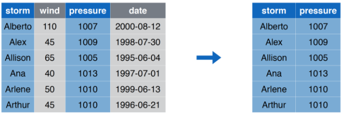
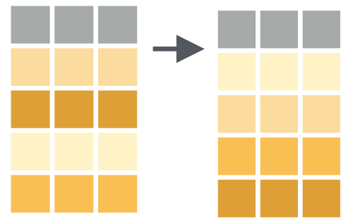

# Importacion y Manejor de Datos { .center .white data-background="#75AADB" }

```{r, include = FALSE}
source("R/setup.R")
knitr::opts_chunk$set(
  fig.path = "img/02-importacion-y-manipulacion-datos/",
  echo = TRUE,
  fig.width = 10,
  fig.height = 6
  )
```

# Importación { .center .white data-background="#75AADB" }

## Orígenes

Los datos puden venir de _muuuuchas_ fuentes

- Archivo de texto
- Excel
- SPSS
- Bases de Datos
- Desde una página web
- Una API

## Funciones para importar

Dependiendo de la fuente se requiere uan __función__ de un
__paquete__ en particular

- Si es archivo de texto csv: `read_csv` del paquete `readr` (que viene en el `tidyverse`)
- Si es un archivo de texto:  `read_delim` del paquete `readr` es una función más general
- Si es un excel: `read_excel` del paquete `readxl`
- Y así...

## Detalles en `read_csv` y `read_delim`


## Ejemplo

```{r}
library(tidyverse)
storms <- read_csv("data/storms.csv")
storms
```

----

```{r}
pollution <- read_csv("data/pollution.csv")
pollution
```


# Manejo de Datos { .center .white data-background="#75AADB" }

## `filter` Seleeccionar Filas


## `filter` Ejemplo 


## `filter` Código

```{r}
filter(storms, storm %in% c("Alberto", "Ana"))

storms %>% 
  filter(storm %in% c("Alberto", "Ana"))
```

## `select` Seleccionar Columnas


## `select` Ejemplo 



## `select` Código

```{r}
select(storms, storm, pressure)

storms %>% 
  select(storm, pressure)
```

## `arrange` Ordenar Filas



## `arrange` Ejemplo 


## `arrange` Código

```{r}
arrange(storms, wind)

storms %>% 
  arrange(wind)
```

## `mutate` Crear/Modificar columnas


## `mutate` Ejemplo 


## `mutate` Código

```{r}
mutate(storms, ratio = pressure/wind, inverse = 1/ratio)

storms %>% 
  mutate(ratio = pressure/wind, inverse = 1/ratio)
```

## `summarize` Resumir Columnas


## `summarize` Ejemplo 


## `summarise` Código

```{r}
summarise(pollution, median = median(amount))

pollution %>% 
  summarise(median = median(amount))
```

## `group_by` + `summarize` Resumir Columnas por Grupos


## `group_by` + `summarize` Ejemplo 


## `group_by` + `summarise` Código

```{r}
pollution %>%
  group_by(city) %>% 
  summarise(
    promedio = median(amount),
    suma = sum(amount),
    n = n()
    )
```

# Ejercicio Práctico { .center }

