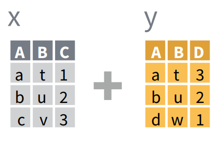
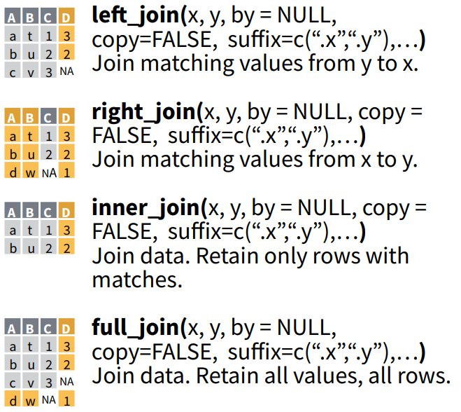

# Manipulación de Datos 2 y Exportación { .center .white data-background="#75AADB" }

```{r, include = FALSE}
source("R/setup.R")
knitr::opts_chunk$set(
  fig.path = "img/03-manipulacion-datos-2-exportacion/",
  echo = TRUE,
  fig.width = 10,
  fig.height = 6
  )
```

# Manipulación de Datos 2 { .center .white data-background="#75AADB" }

## Datos a utilizar

```{r}
library(tidyverse)
data("table4a")
table4a
```

----

```{r}
data("table2")
table2
```

----

```{r}
cases <- read_csv("data/cases.csv")
cases
```

¿Como obtendríamos el promedio por país?

## ¿Como obtendríamos el promedio por país?

```{r}
cases %>% 
  mutate(promedio = (`2011` + `2012` + `2013`)/3)
```

Ahora pensemos en una tabla más grande, con más años 

## `gather` Recolectar 

Coloca nombres de columnas en una variable (columna) __key__, recolectando los 
valores (__value__) de las columnas en un __sola__ columna


## `gather` Ejemplo 


## `gather` Código

```{r}
gather(table4a, `1999`, `2000`, key = "year", value = "cases")
```


## `spread` Esparcir

Esparce un par de columnas (2, key-value) en multiples columnas 


## `spread` Ejemplo 


## `spread` Código


```{r}
spread(table2, type, count)
```

## Joins: Combinar tablas



## Joins Ejemplos



## Joins Código


```{r}
x <- data_frame(
  A = c("a", "b", "c"),
  B = c("t", "u", "v"),
  C = c(1, 2, 3)
  )

y <- data_frame(
  A = c("a", "b", "c"),
  B = c("t", "u", "w"),
  D = c(3, 2, 1)
  )

x
```

----

```{r}
left_join(x, y)

right_join(x, y)
```

----

```{r}
inner_join(x, y)

full_join(x, y)
```

# Exportación { .center .white data-background="#75AADB" }

## Destinos

Los datos puden exportarse de _muuuuchas_ formas

- Archivo de texto
- Excel
- SPSS
- Bases de Datos

## Funciones para exportar

Dependiendo de la fuente se requiere uan __función__ de un
__paquete__ en particular
```{r}

```

- Si es archivo de texto csv: `write_csv` del paquete `readr` (que viene en el `tidyverse`)
- Si es un archivo de texto:  `write_delim` del paquete `readr` es una función más general
- Si es un excel: `write_xlsx` del paquete `writexl`
- Y así...

# Ejercicio Práctico { .center }

## Ejercicio 1 - ¿Qué sucede?

```{r, error=TRUE}
people <- data_frame(
  name = c("Phillip Woods", "Phillip Woods", "Phillip Woods",
           "Jessica Cordero", "Jessica Cordero"),
  key = c("age", "height", "age", "age", "height"),
  value = c(45, 186, 50, 37, 156)
  )
people
spread(people, key, value)
```

## Ejercicio 2

Volviendo a: 

```{r}
cases
```

Calcule el promedio usando una forma mas _elegante_

## Ejercicio 2 - Solución

```{r}
cases %>% 
  gather("año", "valor", `2011`:`2013`) %>% 
  group_by(country) %>% 
  summarise(promedio = mean(valor))
```


